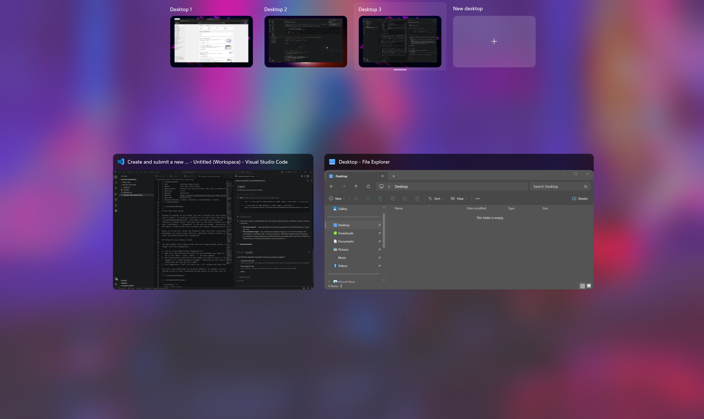

# Task View / Desktop View Styler

A [Windhawk](https://windhawk.net/) mod that **restyles the native Windows 11 Task View (Desktop View) in place** — rounded corners, matching hover/selection radius, and an optional transparent virtual‑desktops bar — without drawing its own UI or hooking input.

It attaches to Explorer's live XAML visual tree via `InitializeXamlDiagnosticsEx` (the same non‑invasive mechanism used by the *Windows 11 Taskbar Styler*) and, as Task View's elements are created, sets `CornerRadius` / `Background` / `BorderThickness` on the elements you target. Nothing is written to disk and no windows are created; disabling the mod reverts everything on the next Task View open.

## Features

- **Rounded corners** on the window cards, desktop cards, **and their hover/selection backplates**, so the radii never conflict.
- **Remove borders** for a flatter look (optional).
- **Clear background** — make the virtual‑desktops bar backplate transparent so only the clean desktops show.
- **Hide elements** — collapse a stray overlay/backplate.
- **Background tint** — optional solid color on matched panels/borders/controls.
- Fully **data‑driven**: every target is a configurable substring list, with a built‑in element‑type logger to discover names on your Windows build.

## Install

1. Install [Windhawk](https://windhawk.net/).
2. Create a new mod and paste the contents of [`task-desktop-view-styler.wh.cpp`](task-desktop-view-styler.wh.cpp), or install it from the Windhawk marketplace once published.
3. Compile and enable.

## Tuning for your Windows build

The XAML element class names inside Task View change between Windows builds, so the target lists are configurable:

1. Turn on **Log element types (diagnostics)** in the mod settings.
2. Open Task View (`Win+Tab`) and hover a thumbnail.
3. Read the log at `%TEMP%\taskview-styler.log` (or via DebugView). Each created element prints as `XAML + <Type>  name=<...>`.
4. Add a distinctive substring of the element you want to style to the relevant list (matching is case‑insensitive and checks both the type and the x:Name).
5. Turn diagnostics **off** for daily use.

### Known element names (Windows 11 build 26200)

| Element | Role |
|---|---|
| `Border` `VirtualDesktopBarBackground` | desktops‑bar backplate (clear to make transparent) |
| `SwitchItemListViewItem` | an open‑window card |
| `Border` `BackgroundBorder` | a window card's hover/selection backplate |
| `VirtualDesktopThumbnailButton` | a desktop card |
| `ListViewItemPresenter` `Root` | a desktop card's hover/selection backplate |
| `Border` `ThumbnailBorderHighlight` | highlight ring around a thumbnail |

## Limitations

- The live window/desktop **previews are DWM‑rendered** inside a `Canvas`, not XAML surfaces, so their own corners can't be rounded — only the surrounding chrome.
- This mod only **sets properties**; it can't change Task View's drag/animation logic (e.g. constraining drag direction or moving the desktops bar to the top without fighting the entrance animation).

## License

MIT — see [LICENSE](LICENSE).
