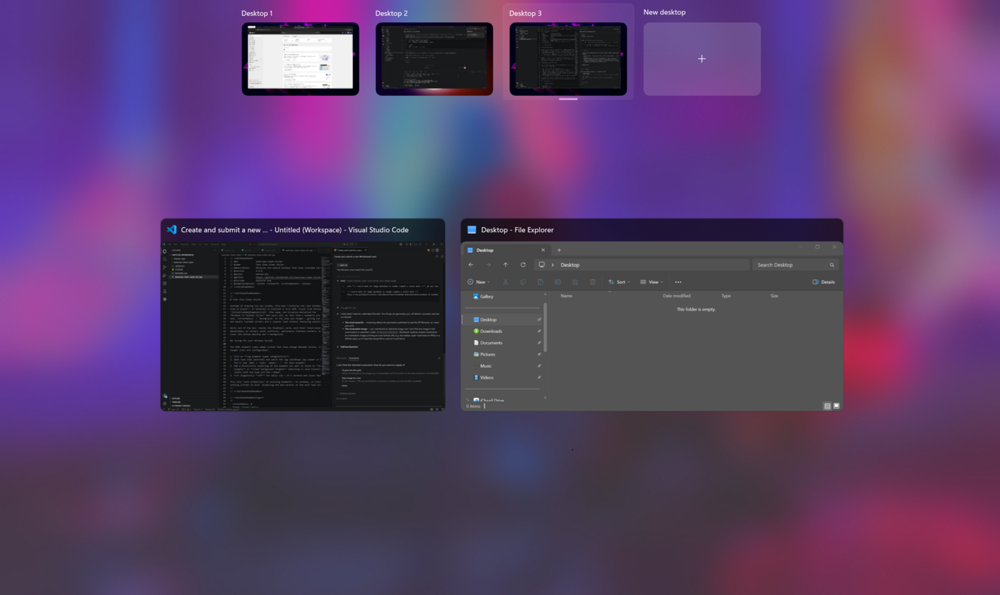

# Clean Task View

A subtle restyle of the Windows 11 **Task View** (the **Desktop View** /
virtual-desktops switcher you get with `Win+Tab`): rounded corners on the
window cards and desktop thumbnails, flattened borders, and a transparent
desktops bar so only the clean desktop previews show.

Unlike a standalone mod, this is a theme for **[Windows 11 Taskbar
Styler](https://windhawk.net/mods/windows-11-taskbar-styler)**, so it shares
that mod's single XAML Diagnostics connection and coexists with the rest of
your taskbar styling.

**Author**: mahtab-ali



## How to use

1. Install **Windows 11 Taskbar Styler** in Windhawk.
2. Open its **Settings → Advanced → Textual mode**.
3. Paste the YAML below into the settings box (merge it with your existing
   `controlStyles:` list if you already have one — keep a single
   `controlStyles:` key and append these entries under it).
4. Save. Open Task View with `Win+Tab` to see the result.

## Styles

```yaml
controlStyles:
  # ── Window cards in Task View (the Win+Tab thumbnails) ───────────────
  #    Round the card and its resting/hover/selection backplate together
  #    so the corners never disagree, and flatten the border.
  - target: SwitchItemListViewItem
    styles:
      - CornerRadius=8
      - BorderThickness=0
  - target: ListViewItemPresenter
    styles:
      - CornerRadius=8
      - BorderThickness=0
  - target: Border#ThumbnailBorderHighlight
    styles:
      - CornerRadius=8
      - BorderThickness=0
  - target: Border#BackgroundBorder
    styles:
      - CornerRadius=8
      - BorderThickness=0

  # ── Virtual-desktop thumbnails in the bottom bar ─────────────────────
  - target: VirtualDesktopThumbnailButton
    styles:
      - CornerRadius=8
      - BorderThickness=0

  # ── Clear the bottom desktops-bar backplate so only the desktops show ─
  - target: Border#VirtualDesktopBarBackground
    styles:
      - Background=Transparent
      - BorderThickness=0
```

## Tuning for your Windows build

Task View's XAML element names change between Windows builds. If part of this
theme doesn't apply on your machine:

- In **Windows 11 Taskbar Styler**, open the **visual tree** / element
  inspector, open Task View, and find the real type name or `x:Name` of the
  element you want to style.
- Adjust the `target:` selectors above to match. A bare type (e.g.
  `SwitchItemListViewItem`) matches every element of that type; `Type#Name`
  (e.g. `Border#VirtualDesktopBarBackground`) matches a named element.

## Notes

- Adjust `CornerRadius=8` to taste.
- To tint a card instead of leaving it as-is, add a `Background=#CC202024`
  style (AARRGGBB) to the relevant target.
